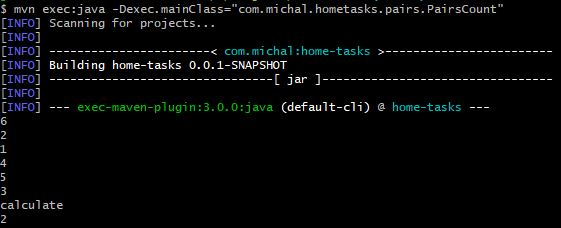
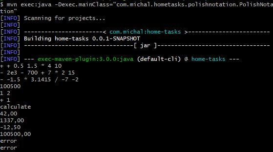
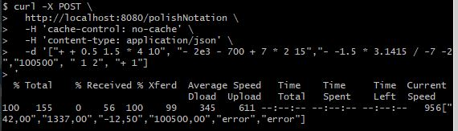
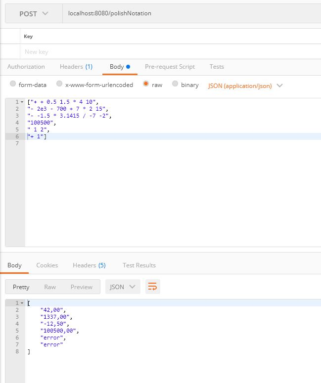

# Home assignment

The repository contains home tasks solutions:
1. Finding pairs in an array with a given sum
2. Polish Notation expression calculator
3. Spring Boot application providing REST API to compute Polish Notation result

mvn exec:java -Dexec.mainClass="com.michal.hometasks.pairs.PairsCount"

## Requirements
* JDK 11
* Maven

## Running locally
### Task 1 - Pairs counter (CLI)
To run the program, execute the following command in the project root directory (where the pom.xml file is located):

mvn exec:java -Dexec.mainClass="com.michal.hometasks.pairs.PairsCount"  
Then provide the input arguments (The values k and a[0], a[1], ... a[n - 1], one value per line).  
To calculate the result, type "calculate" in the CLI and click enter.  

### Task 2 - Polish Notation expression calculator (CLI)

To run the program, execute the following command in the project root directory (where the pom.xml file is located):

mvn exec:java -Dexec.mainClass="com.michal.hometasks.polishnotation.PolishNotation"  
Then provide the input arguments (A list of expressions to evaluate, one expression per line).  
To calculate the result, type "calculate" in the CLI and click enter.

### Task 3 - Polish Notation expression calculator (REST API)

To run the program, execute the following command in the project root directory (where the pom.xml file is located):

    ./mvnw clean spring-boot:run

The application will be launched at localhost:8080.  To calculate the result of Polish Notation you need to send a POST request to the endpoint http://localhost:8080/polishNotation with a expressions list.
Example request  (CURL version):

    curl -X POST \
      http://localhost:8080/polishNotation \
      -H 'content-type: application/json' \
      -d '["+ + 0.5 1.5 * 4 10", "- 2e3 - 700 + 7 * 2 15","- -1.5 * 3.1415 / -7 -2","100500", " 1 2", "+ 1"]'

You can also use Postman:
  

Swagger doc: http://localhost:8080/swagger-ui/index.html

